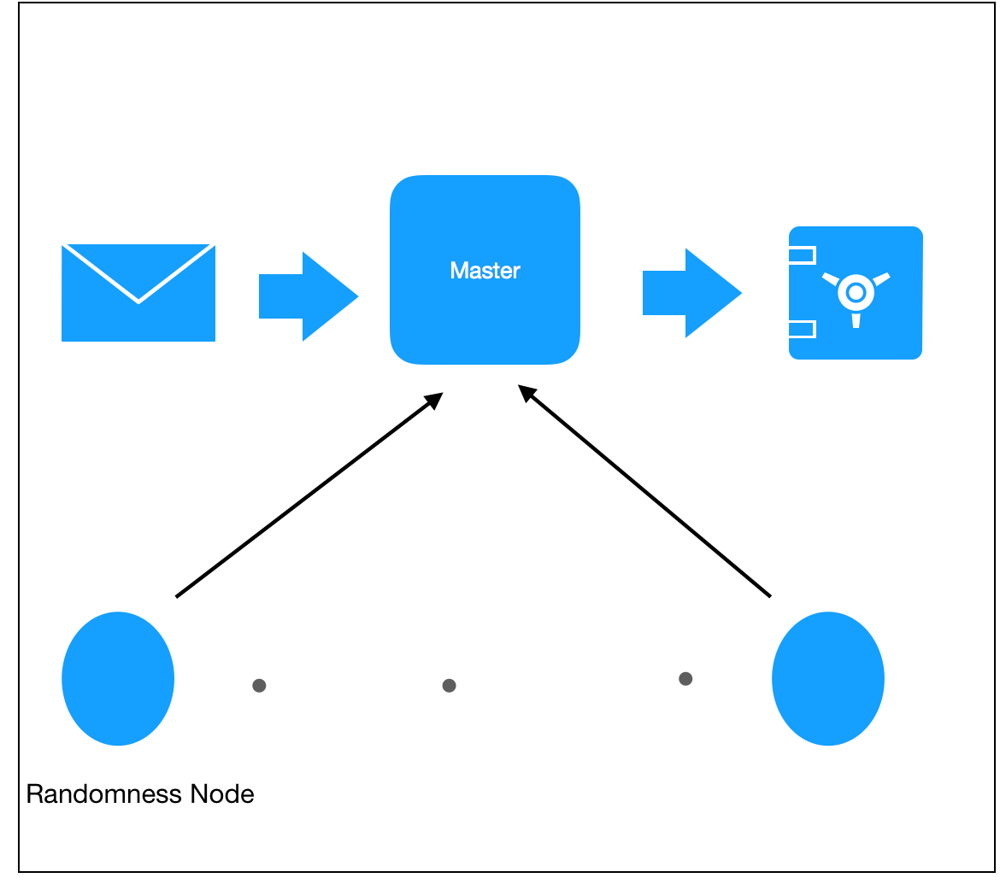

# Automated Distributed Key Generation for the Blockchain

Authors: Chase Smith, Abhishek Punia

## **Abstract**

This project will dive into on-chain public key generation through the use of distributed key generation. It will provide a proof of concept as well as javascript libraries.

## **Problem**

### **Background**
Randomness and dynamic public key encryption are difficult to obtain on the blockchain because of the way the public ledger works. Despite, the difficulty randomness and public key encryption have many use cases on the blockchain.

### **Current Implementations**

#### *Randao*
Randao is a package that combines keys from multiple "stakers" to combine a lot of public keys to create one larger public key, private key encryption. Even though this method uses staking to ensure that users cannot fail their commitments, but it still faces the problem of the last submitter withholding information. 

#### *Random Oracles*
Other implementations attempt to create randomness off-chain via a central oracle or an oracle network that requires payment, and then broadcast this on-chain. This puts the randomness in the hands of some central authority though and does not get around the problem.

#### *Randomness through contract variables*
Other methods of randomness come from looking at things like the blockhash (which is technically random), but these face issues with manipulation 

### **State of the Art: Distributed Key Generation**

A growing number of ICOs like Keep and Gnosis discuss DKG or distributed key generation as a method to mitigate the front-running aspect. While they have implemented these methods in their own codebase, these libraries are not readily and easily available to the general public. Distributed Key Generation prevents the last submitter from witholding their answer because each key can be generated by a threshold of m individuals. This is done through polynomial interpolation.  

## **Solution: Distributed Key Generation**

This project will be intended to display a proof of concept for distributed key generation, a library for key generation that any dApp can use, and will aspire to make on-chain randomness public.

### **dApp Overview and Design**

The dApp itself will be made to show easy random key generation, and link to the javascript library for DKG as well as a solidity library. The webpage will show the functions of the library, and provide documentation for its use and implementation in other dApps.  

### **Platform Overview**

The platform is designed to utilized libraries built-in javascript to provide in-house distributed key generation. This implementation works by have one smart contract serve as the master that delegates operations to the "slaves" or the "randomness producers". The randomness nodes are also smart contracts, but they are populated by off-chain data from the DKG library.

### **Platform Architecture**
Below is a diagram of the platform architecture. 

## **Implementation Details**

The platform is designed to utilized libraries built-in javascript to provide in-house DKG. It contains two smart contract components, the master and the randomness node:

* Master 
    * Aggregates the public key data and the encrypted polynomial coefficients and points for each Randomness Node
    * It dictates the distribution of unencrypted points to randomness nodes
    * Accounts for verification of polynomial points, and requests private keys when done
    * Generates the combined public key

* Randomness Node
    * Sends public key, and encrypted polynomial coefficents to master
    * Sends private points to master encrpyted with public key of the nodes
    * Verifies that points given to it are valid
    * Sends private key at the reveal stage

## **Use Cases** 

The platform is designed to utilized libraries built-in javascript to provide in-house DKG. There exist many use cases for this type of public key generation.

* *On-chain Randomness*

* *Dynamic on-chain Public Key generation*

* *Trustless key/money retrieval* 

* *On-chain Oracles*

* *Multiparty Commitment Schemes* 

* *Bidding, auctions, bets for Prediction markets* 

* *Private Message between multiple parties on-chain*

## **Security Considerations**

There exist several security considerations that need to be addressed in this implementation.
 * What if there are malicious parties that submit keys that are not random?

 * What if someone uses software that does not submit the private key?

 * What kind of connectivity do these extensions need to have?

 * How do we send messages without having individuals find out the data?

 * How can we make this public key quantum resistant (lattices)?

 * How can we make the public key generation time based?

 * How to determine if there are enough nodes?

## Future Directions

This project can go into several future directions:

* Creating a White Paper and ICO to create this network
* Developing a chrome extension for this project to allow for any thing
* JS code must be checked via hash. 
* Decentralized automated distributed key generation network through a wallet sdk
* JS library for DKG integration into dApps 
* Solidity library for integration into dApps
* Further research into Quantum resistant Distributed Key Generation using lattice structures 
 

